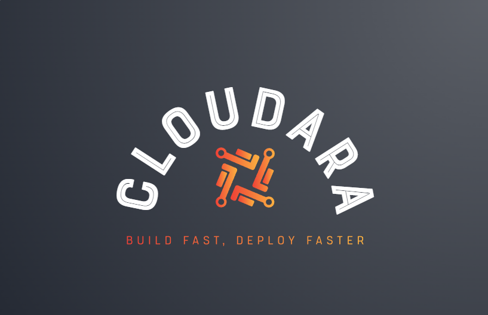
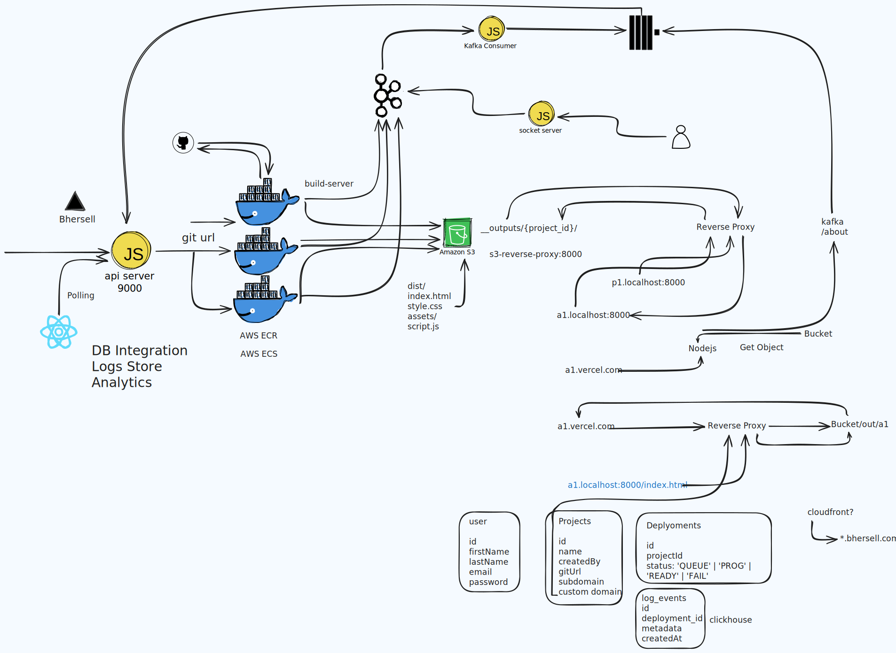

# Cloudara

<div align="center">
  
</div>

Cloudara is a modern deployment platform that enables developers to instantly deploy their web applications from GitHub repositories with minimal configuration. It provides auto-deployment, custom subdomains, and real-time build logs.

<div style="display: flex; gap: 10px;">
  
  
</div>

## Features

- **One-Click Deployments**: Deploy any web application directly from GitHub with a single URL
- **Real-time Build Logs**: Watch your build process unfold in real-time with WebSocket streaming
- **Automatic Subdomain Generation**: Each project gets a unique subdomain
- **Serverless Architecture**: Utilizes AWS S3 for static hosting and ECS for build processing
- **Scalable Infrastructure**: Built to handle multiple concurrent builds and deployments

## Architecture

Cloudara consists of several microservices working together:



| Service | Purpose |
|---------|---------|
| `api-server` | Handles REST API requests for project creation and deployments |
| `socket.io-server` | Streams real-time build logs to the client |
| `s3-reverse-proxy` | Routes subdomain requests to the appropriate S3 content |
| `build-server` | Docker container that clones, builds and uploads projects |

## Prerequisites

- Node.js 16.x or higher
- Redis server (for caching and pub/sub)
- Clickhouse (for logs storage)
- Docker (for local build server execution)
- AWS account with configured credentials (for production)

## Quick Start

The easiest way to get Cloudara running locally is with the `start.js` script:

```bash
# Clone the repository
git clone https://github.com/Sid-Lais/cloudara.git
cd cloudara

# Install dependencies
npm install     (inside `api-server`, `s3-reverse-proxy` & `frontend-nextjs`)

# Start all services
node start.js
```

After starting, you can access:

- Frontend: <http://localhost:3000>
- API Server: <http://localhost:9000>
- S3 Reverse Proxy: <http://localhost:8000> (for viewing deployed sites)

## Manual Setup

If you prefer to configure each service individually:

1. API Server
2. Socket.IO Server
3. S3 Reverse Proxy
4. Frontend
5. Build Server

For local development, you can run the build server in a Docker container:

## Configuration

Cloudara can be configured through environment variables. Copy the `.env.example` file to `.env` in each service directory and adjust the values to match your environment.

### Key Configuration Options

- `AWS_REGION`: The AWS region where your resources are located
- `AWS_ACCESS_KEY_ID` and `AWS_SECRET_ACCESS_KEY`: Your AWS credentials
- `S3_BUCKET_NAME`: The bucket where deployed sites will be stored
- `REDIS_URL`: Connection string for your Redis instance
- `ECS_CLUSTER_ARN`: ARN of your ECS cluster (for production)
- `ECS_TASK_DEFINITION_ARN`: ARN of your task definition (for production)

## API Reference

The API server exposes the following endpoints:

- `POST /project`: Create a new project
- `POST /deploy`: Trigger a deployment for a project
- `GET /deployment/:id/logs`: Get logs for a specific deployment

For detailed API documentation, see `API.md`.

## Development

To contribute to Cloudara, make sure you have all prerequisites installed locally. Then:

1. Fork the repository
2. Create a feature branch (`git checkout -b feature/amazing-feature`)
3. Commit your changes (`git commit -m 'Add some amazing feature'`)
4. Push to the branch (`git push origin feature/amazing-feature`)
5. Open a Pull Request

## Production Deployment

For production deployment, we recommend:

- Setting up AWS ECS for the build server
- Configuring AWS S3 buckets for static hosting
- Using a managed Redis service
- Implementing a custom domain with proper SSL certificates

Detailed production deployment instructions can be found in `DEPLOYMENT.md`.

## Acknowledgments

- Next.js for the frontend framework
- Node.js for the backend services
- Socket.IO for real-time communication
- AWS for cloud infrastructure

Built with ❤️ using Next.js, Node.js, and AWS
